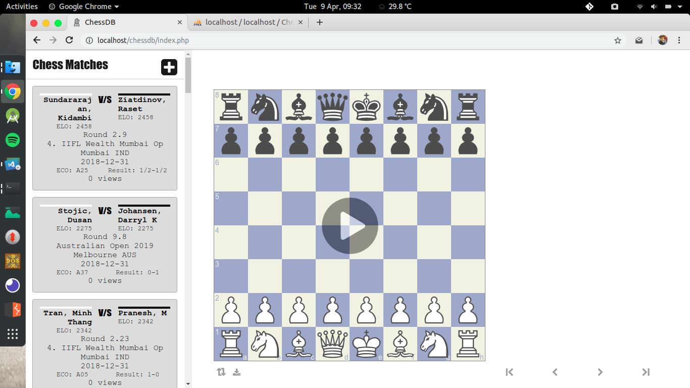
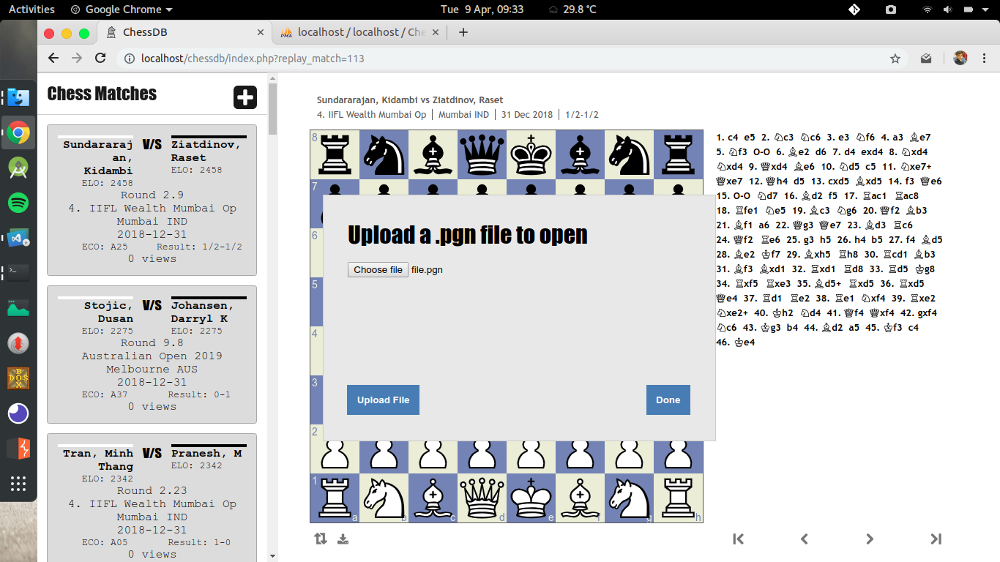
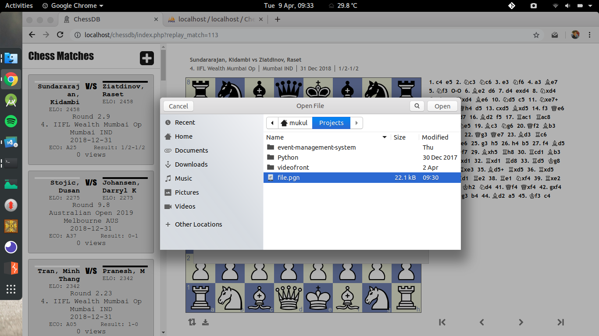
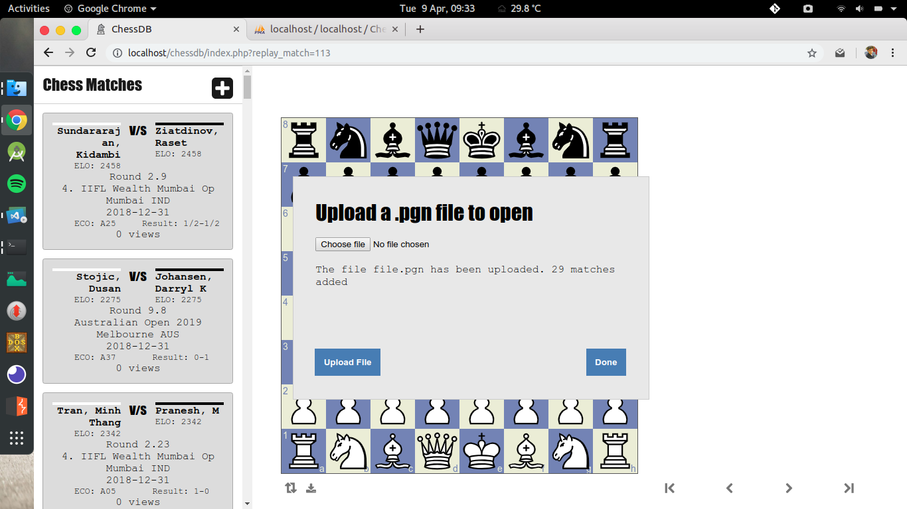
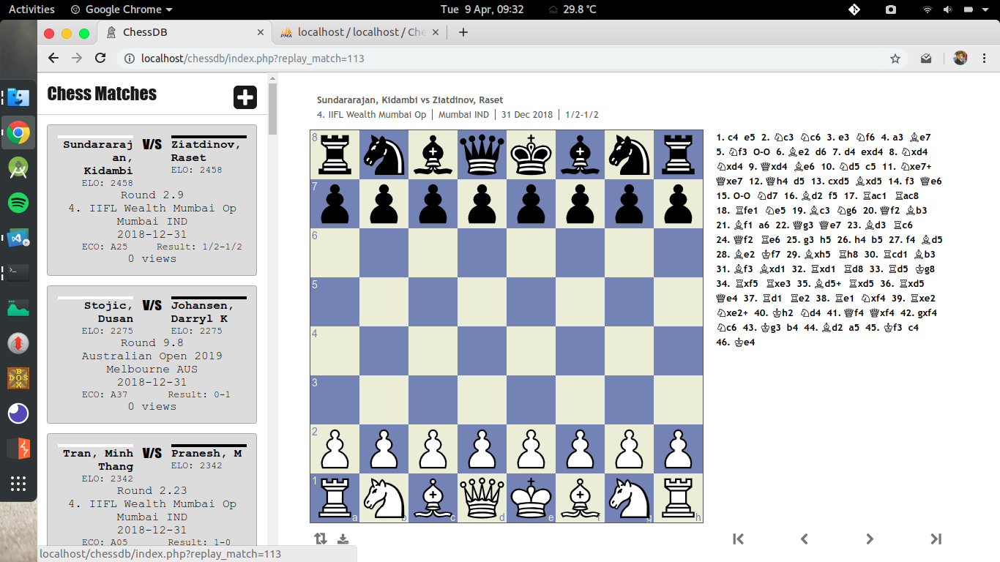
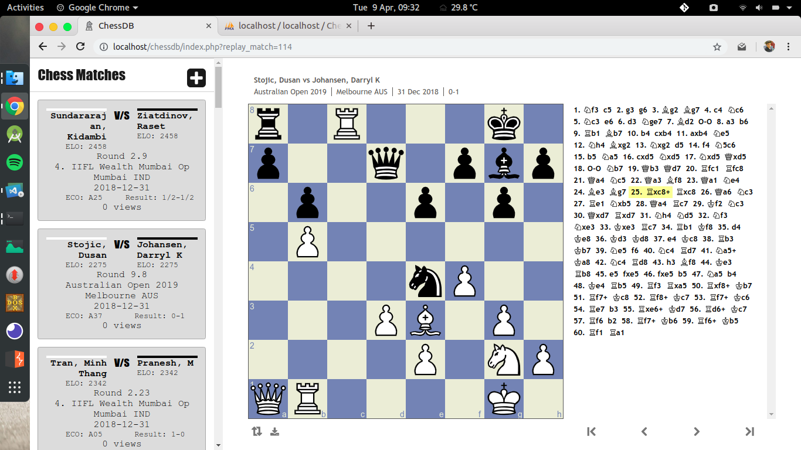

# chess_db
A portal to upload and replay chess games

Users will be able to upload chess games in .pgn format. The games will be saved in the database which then can be viewed later.

### Screens

### Installation
An 'uploads' folder needs to be created with required permissions.
Update the 'uploads' folder path in $target_file variable in upload_file.php
